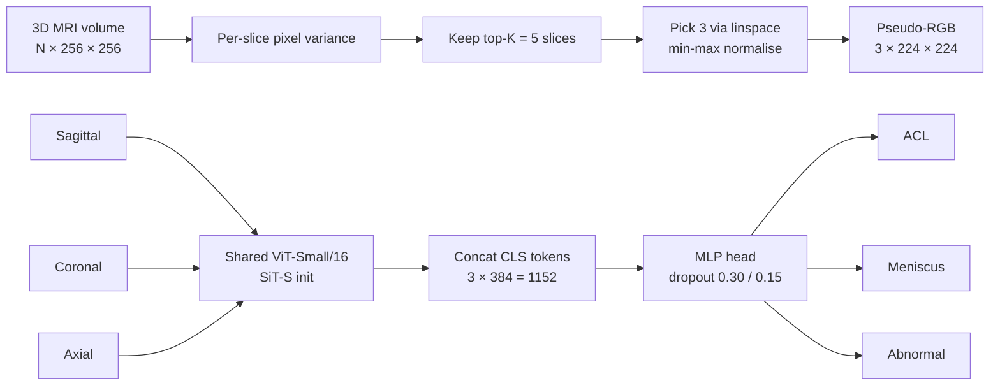

# Multi-View Vision Transformer for Knee MRI Abnormality Classification (MRNet)


A multi-view **ViT-Small/16** initialised with **SiT-S self-supervised weights** that jointly predicts **ACL tears, meniscal tears, and general abnormalities** from all three planes of a knee MRI exam (sagittal, coronal, axial) on the Stanford **MRNet** dataset.

> Coursework project for **EEEM068 Applied Machine Learning**, University of Surrey (Spring 2026).
> 📄 Full write-up: [`report/EEM068_Report.pdf`](report/EEM068_Report.pdf)

<!-- Replace with a real figure from mrnet_outputs/, e.g. attention_maps.png -->
<p align="center">
  
</p>

---

## Highlights

- **Multi-view, multi-label.** One shared ViT-Small backbone encodes all three MRI planes; the `[CLS]` embeddings are fused and passed to a head with three independent sigmoid outputs.
- **3D → 2D without losing the signal.** A top-K pixel-variance slice selector turns variable-depth volumes (17–51 slices) into fixed pseudo-RGB images that work with ImageNet-style pretraining.
- **Built for a small, imbalanced dataset.** SiT-S self-supervised initialisation, per-label Focal Loss with a weighted sampler, progressive unfreezing, layer-wise learning rates, MixUp and DropPath.
- **Interpretable.** Attention rollout shows where the model looks, with a small out-of-distribution probe on an internet-sourced image.
- **Ablation on pretraining.** A from-scratch ViT-Small baseline for sagittal ACL detection shows how much the model relies on pretrained representations.

## Results

Validation split (n = 170, stratified 15% of the MRNet training set), with per-label thresholds:

| Label     | Threshold τ | Accuracy | Sensitivity | Specificity | F1    | AUC   |
|-----------|:-----------:|:--------:|:-----------:|:-----------:|:-----:|:-----:|
| ACL       | 0.85        | 0.865    | 0.652       | 0.898       | 0.566 | 0.846 |
| Meniscus  | 0.70        | 0.741    | 0.899       | 0.634       | 0.738 | 0.837 |
| Abnormal  | 0.20        | 0.871    | 0.978       | 0.424       | 0.924 | 0.847 |
| **Macro** | —           | **0.826**| **0.843**   | **0.652**   | **0.743** | **0.844** |

**Pretraining ablation (binary ACL, sagittal plane only):**

| Model | Initialisation | Accuracy | F1 | AUC | Params |
|---|---|:-:|:-:|:-:|:-:|
| SB-SSL, Atito et al. (2022) — reported | SSL on MRNet | 0.883 | — | 0.951 | ~21M |
| ViT-Small (ours) | None (from scratch) | 0.650 | 0.656 | 0.740 | 21.8M |

> **Note on evaluation:** the official MRNet test set is hidden behind Stanford's submission portal, so all numbers are on a held-out validation split. Model selection and threshold tuning were also done on this split, so the figures are likely somewhat optimistic. The SB-SSL comparison is illustrative, not a like-for-like reproduction.

## Method



| Component | Choice |
|---|---|
| Backbone | ViT-Small/16 (12 blocks, D = 384, 6 heads), shared across planes — 22.39M params total |
| Initialisation | SiT-S, ImageNet ([official weights](https://github.com/Sara-Ahmed/SiT)) |
| Loss | Per-label Focal Loss, γ = 0.5, α = (0.82, 0.63, 0.19) |
| Imbalance | `WeightedRandomSampler` (ACL-positive scans seen ~4× more often) |
| Optimiser | AdamW, layer-wise LR: head 1e-3, top-6 blocks 1e-5, early blocks 5e-6 |
| Schedule | Progressive unfreezing (head → top-6 → full), cosine warmup restarts |
| Regularisation | MixUp (p = 0.4), DropPath 0.1, RandomAffine, H-flip, ColorJitter |
| Thresholds | Per-label, tuned on validation (F1 / Youden's J) |
| Interpretability | Attention rollout (Abnar & Zuidema, 2020) |

## Repository structure

```
.
├── notebooks/
│   ├── EEEM068_SiT_S_Final_FIXED.ipynb              # Main multi-view, multi-label model
│   └── EEEM068_Extrawork_Sagital_ACL_SCRATCH.ipynb  # From-scratch ViT ablation (ACL, sagittal)
├── report/
│   └── EEM068_Report.pdf
├── assets/                                          # Figures used in this README
├── requirements.txt
└── README.md
```

## Getting started

### 1. Install dependencies

```bash
git clone https://github.com/Safayet-xx/AML-Knee-Abnormality.git
cd AML-Knee-Abnormality
pip install -r requirements.txt
```

Main dependencies: `torch`, `torchvision`, `timm`, `numpy`, `pandas`, `scikit-learn`, `matplotlib`, `seaborn`, `pillow`, `tensorboard`, `kagglehub`.

### 2. Get the data

MRNet is released under a Stanford research use agreement, so **the data is not included in this repo**. Request access from the [Stanford AIMI MRNet page](https://stanfordmlgroup.github.io/competitions/mrnet/), or download the Kaggle mirror:

```python
import kagglehub
path = kagglehub.dataset_download("cjinny/mrnet-v1")
```

### 3. Get the SiT-S weights

Download `SiT_Small_ImageNet.pth` from the [official SiT repository](https://github.com/Sara-Ahmed/SiT) and place it in a local folder (e.g. `weights/`).

### 4. Configure and run

Open `notebooks/EEEM068_SiT_S_Final_FIXED.ipynb`, set the dataset path (`CFG.ROOT`) and SiT checkpoint path (`CFG.SIT_DIR`) in **Section 1**, then run all cells top to bottom.

Training was run on an NVIDIA RTX A4000 (16 GB), batch size 8, seed 42, with early stopping (patience 15). Training curves are logged to TensorBoard:

```bash
tensorboard --logdir mrnet_outputs/tb_logs
```

## Limitations

- Evaluated only on MRNet; the out-of-distribution probe suggests sensitivity to domain shift (scanner protocol, compression, 2D vs 3D context).
- Thresholds and checkpoint selection share the same validation split used for reporting.
- Slice selection compresses each plane to 3 slices, discarding some volumetric context.
- ACL F1 (0.566) is the weakest result, reflecting its low prevalence (19.3%).

**This is a research/coursework project and is not intended for clinical use.**

## Future work

- Learned inter-plane attention fusion instead of concatenation (Qiu et al., 2024)
- Self-supervised pretraining directly on MRNet volumes
- Multi-site external validation

## References

- Bien et al. (2018). Deep-learning-assisted diagnosis for knee MRI: MRNet. *PLOS Medicine*.
- Ahmed et al. (2021). SiT: Self-supervised vIsion Transformer. *arXiv:2104.03602*.
- Atito et al. (2022). SB-SSL: Slice-based self-supervised transformers for knee abnormality classification from MRI. *MICCAI Workshops*.
- Azcona et al. (2020). A comparative study of deep learning methods for detecting knee injuries using MRNet. *arXiv:2010.01947*.
- Dosovitskiy et al. (2021). An image is worth 16x16 words. *ICLR*.
- Lin et al. (2017). Focal loss for dense object detection. *ICCV*.
- Abnar & Zuidema (2020). Quantifying attention flow in transformers. *ACL*.

The full reference list is in the [report](report/EEM068_Report.pdf).

## Acknowledgements

- Stanford ML Group for the MRNet dataset
- Sara Ahmed et al. for the SiT pretrained weights
- The [`timm`](https://github.com/huggingface/pytorch-image-models) library
- University of Surrey, EEEM068 Applied Machine Learning

## Author

**[Your Name]** — MSc, University of Surrey
[LinkedIn](https://linkedin.com/in/your-profile) · [Email](mailto:you@example.com)
